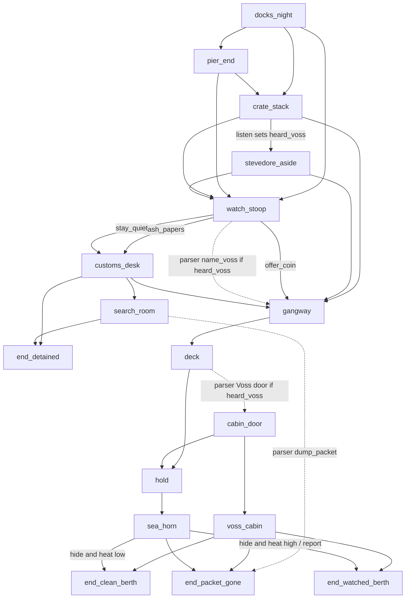

# Night Tide — v1 graph

## Win / lose (LOCKED)

- **Win (`end_clean_berth`)**: Aboard, packet still sealed (or safely stashed), `wanted_heat <= 1`.
- **Bittersweet (`end_watched_berth`)**: Aboard, but the crew or watch will remember you (`wanted_heat >= 2`, opened packet delivered, or you report yourself).
- **Lose detained (`end_detained`)**: Customs keeps you. Packet seized or you run from the desk.
- **Lose packet (`end_packet_gone`)**: You are not in a cell, but the packet is gone.

Fourth ending is extra; spec asked for at least three.

## Flag payoff (two nodes earlier)

`crate_stack.listen_stevedore` sets `heard_voss`.
Parser-only `watch_stoop.name_voss` requires that flag. Buttons on the stoop stay honest (papers / coin / silence). Same flag later unlocks parser-only `deck.ask_voss_door`.

## Parser-only exits (bonus, not required)

- `watch_stoop.name_voss` — type “Voss sent me”
- `search_room.dump_packet` — type “I ditch the packet”
- `deck.ask_voss_door` — type “take me to Voss”

## Metrics used in v1

`nerve`, `caution`, `wanted_heat` — all 0–3, declared in `data/world.yaml`. Other games replace the block.

## Graph

Dotted = parser-only.

## Node count

12 playable rooms + 4 endings. Vertical slice is complete.
